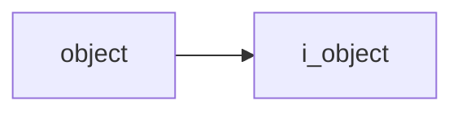
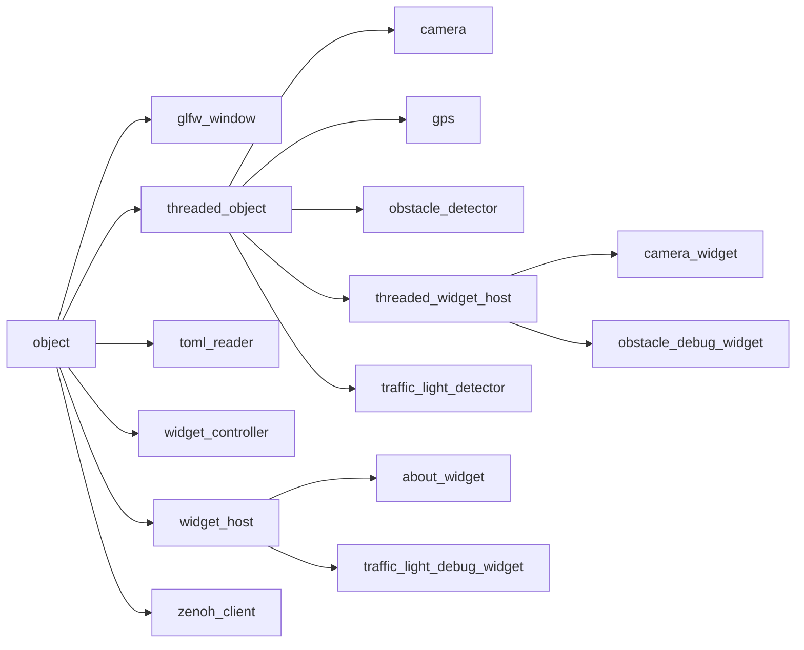

# Object

- **Class**: `object`
- **Namespace**: `acs::core`
- **Include**: `#include "core/implementations/object.h"`

## Overview

Concrete `i_object` base implementation that provides stable component identity via a tag and serves as the root for non-threaded ACS components.

## Inheritance Diagram

### Base Diagram



### Derived Diagram



## Inheritance Hierarchy

### Base Hierarchy

- [`object`](object.md)
  - [`i_object`](../interfaces/i_object.md)

### Derived Hierarchy

- [`object`](object.md)
  - [`glfw_window`](../../gui/implementations/glfw_window.md)
  - [`threaded_object`](threaded_object.md)
    - [`camera`](../../vision/implementations/camera.md)
    - [`gps`](../../utility/implementations/gps.md)
    - [`obstacle_detector`](../../vision/implementations/obstacle_detector.md)
    - [`threaded_widget_host`](../../gui/implementations/threaded_widget_host.md)
      - [`camera_widget`](../../gui/implementations/widgets/camera_widget.md)
      - [`obstacle_debug_widget`](../../gui/implementations/widgets/obstacle_debug_widget.md)
    - [`traffic_light_detector`](../../vision/implementations/traffic_light_detector.md)
  - [`toml_reader`](../../utility/implementations/toml_reader.md)
  - [`widget_controller`](../../gui/implementations/widget_controller.md)
  - [`widget_host`](../../gui/implementations/widget_host.md)
    - [`about_widget`](../../gui/implementations/widgets/about_widget.md)
    - [`traffic_light_debug_widget`](../../gui/implementations/widgets/traffic_light_debug_widget.md)
  - [`zenoh_client`](../../utility/implementations/zenoh_client.md)

## API

### Constructors
#### Constructor

```cpp
explicit object(std::string_view tag);
```
Creates a base object with a unique component tag.

##### Parameters
- `tag` (`std::string_view`): Unique component tag used for logging, diagnostics, and lifecycle identification.

### Public Methods

#### Implementations
- [`i_object`](../interfaces/i_object.md)
    - [`get_tag`](../interfaces/i_object.md#get-tag)
