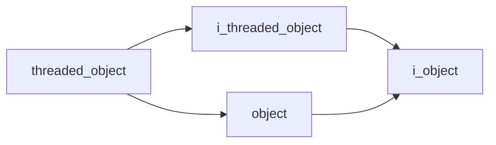
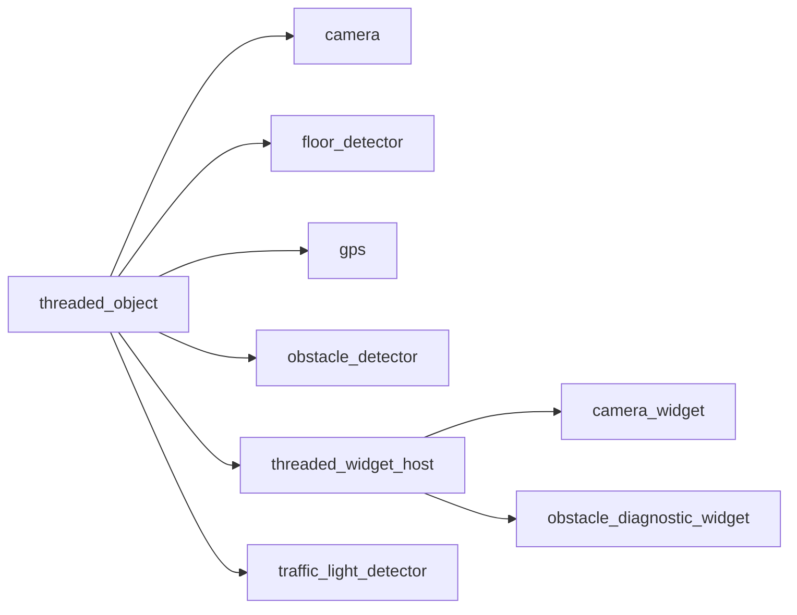

# Threaded Object

- **Class**: `threaded_object`
- **Namespace**: `acs::core`
- **Include**: `#include "core/implementations/threaded_object.h"`

## Overview

Concrete `i_threaded_object` base implementation that provides a managed periodic update loop for derived components.

## Inheritance Diagram

### Base Diagram



### Derived Diagram



## Inheritance Hierarchy

### Base Hierarchy

- [`threaded_object`](threaded_object.md)
  - [`i_threaded_object`](../interfaces/i_threaded_object.md)
    - [`i_object`](../interfaces/i_object.md)
  - [`object`](object.md)
    - [`i_object`](../interfaces/i_object.md)

### Derived Hierarchy

- [`threaded_object`](threaded_object.md)
  - [`camera`](../../vision/implementations/camera.md)
  - [`floor_detector`](../../vision/implementations/floor_detector.md)
  - [`gps`](../../utility/implementations/gps.md)
  - [`obstacle_detector`](../../vision/implementations/obstacle_detector.md)
  - [`threaded_widget_host`](../../gui/implementations/threaded_widget_host.md)
    - [`camera_widget`](../../gui/implementations/widgets/camera_widget.md)
    - [`obstacle_diagnostic_widget`](../../gui/implementations/widgets/obstacle_diagnostic_widget.md)
  - [`traffic_light_detector`](../../vision/implementations/traffic_light_detector.md)

## API

### Constructors
#### Constructor

```cpp
threaded_object(std::string_view tag, float update_rate);
```
Creates a threaded object with identity metadata and initial loop frequency.

##### Parameters
- `tag` (`std::string_view`): Unique component tag used for logging, diagnostics, and lifecycle identification.
- `update_rate` (`float`): Requested update-loop frequency in Hz.

### Public Methods

#### Implementations
- [`i_threaded_object`](../interfaces/i_threaded_object.md)
    - [`start`](../interfaces/i_threaded_object.md#start)
    - [`stop`](../interfaces/i_threaded_object.md#stop)
    - [`get_update_rate`](../interfaces/i_threaded_object.md#get-update-rate)
    - [`set_update_rate`](../interfaces/i_threaded_object.md#set-update-rate)
    - [`get_is_running`](../interfaces/i_threaded_object.md#get-is-running)

### Protected Methods
#### Update

```cpp
virtual void update() = 0;
```
Performs one derived-class update iteration invoked by the internal thread loop.

!!! note
    Pure virtual method, must be implemented by derived classes.
