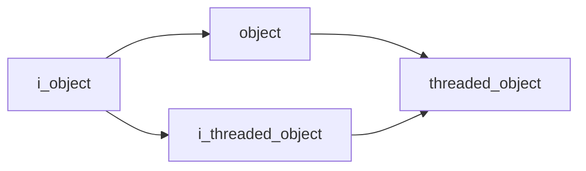

# Core Namespace

## Overview

The `acs::core` namespace defines the base object model for ACS. It provides `i_object` for shared identity (a debug-facing tag/name) and `i_threaded_object` for managed periodic execution in derived objects.

## Namespace Contents

### Interfaces

- [i_object](interfaces/i_object.md)
- [i_threaded_object](interfaces/i_threaded_object.md)

### Implementations

- [object](implementations/object.md)
- [threaded_object](implementations/threaded_object.md)

## Inheritance Hierarchy

