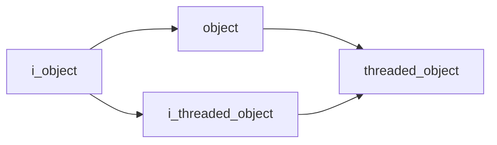

# Core Namespace

## Overview

The `acs::core` namespace provides the foundational component system for the autonomous control system. It defines interfaces and base classes for managing component lifecycles, updates, and threaded execution.

## Namespace Contents

### Interfaces

- [i_object](interfaces/i_object.md)
- [i_threaded_object](interfaces/i_threaded_object.md)

### Implementations

- [object](implementations/object.md)
- [threaded_object](implementations/threaded_object.md)

## Inheritance Hierarchy

