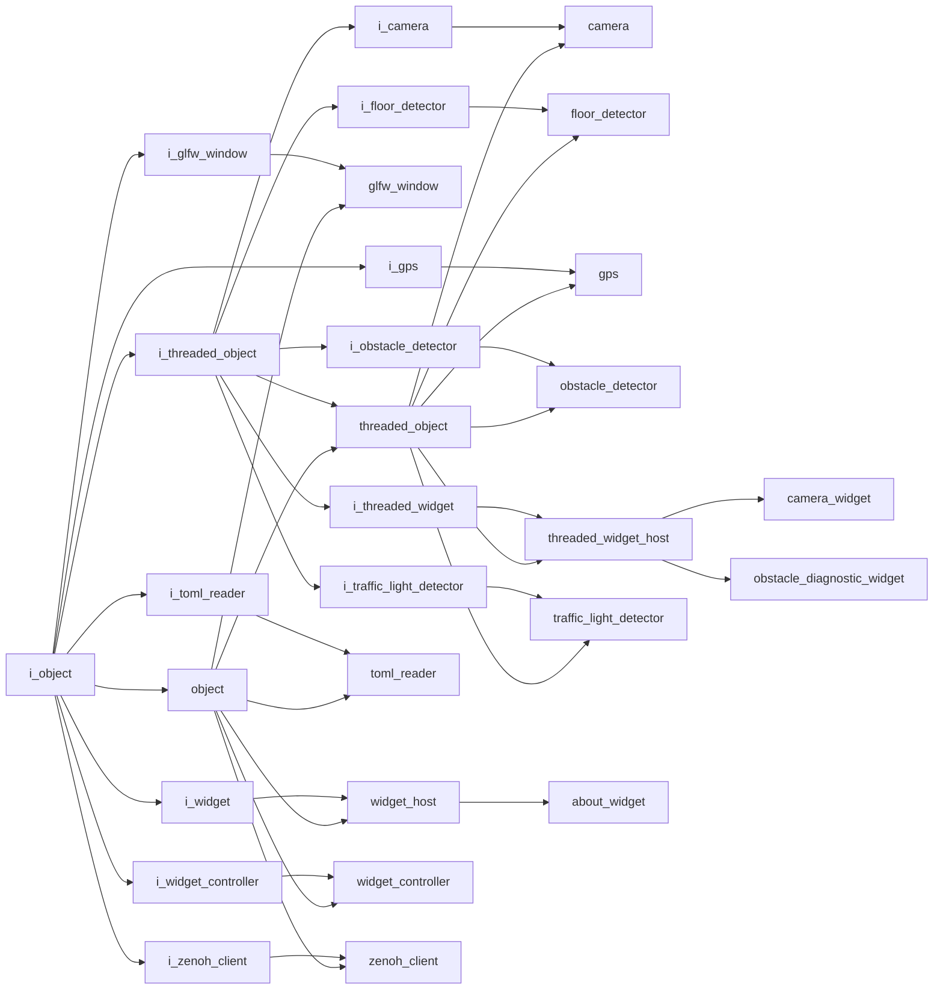

# Object Interface

- **Interface**: `i_object`
- **Namespace**: `acs::core`
- **Include**: `#include "core/interfaces/i_object.h"`

## Overview

Base interface for all ACS components, providing shared identity and lifecycle integration points.

## Inheritance Diagram

### Derived Diagram



## Inheritance Hierarchy

### Derived Hierarchy

- [`i_object`](i_object.md)
  - [`i_glfw_window`](../../gui/interfaces/i_glfw_window.md)
    - [`glfw_window`](../../gui/implementations/glfw_window.md)
  - [`i_gps`](../../utility/interfaces/i_gps.md)
    - [`gps`](../../utility/implementations/gps.md)
  - [`i_threaded_object`](i_threaded_object.md)
    - [`i_camera`](../../vision/interfaces/i_camera.md)
      - [`camera`](../../vision/implementations/camera.md)
    - [`i_floor_detector`](../../vision/interfaces/i_floor_detector.md)
      - [`floor_detector`](../../vision/implementations/floor_detector.md)
    - [`i_obstacle_detector`](../../vision/interfaces/i_obstacle_detector.md)
      - [`obstacle_detector`](../../vision/implementations/obstacle_detector.md)
    - [`i_threaded_widget`](../../gui/interfaces/i_threaded_widget.md)
      - [`threaded_widget_host`](../../gui/implementations/threaded_widget_host.md)
        - [`camera_widget`](../../gui/implementations/widgets/camera_widget.md)
        - [`obstacle_diagnostic_widget`](../../gui/implementations/widgets/obstacle_diagnostic_widget.md)
    - [`i_traffic_light_detector`](../../vision/interfaces/i_traffic_light_detector.md)
      - [`traffic_light_detector`](../../vision/implementations/traffic_light_detector.md)
    - [`threaded_object`](../implementations/threaded_object.md)
      - [`camera`](../../vision/implementations/camera.md)
      - [`floor_detector`](../../vision/implementations/floor_detector.md)
      - [`gps`](../../utility/implementations/gps.md)
      - [`obstacle_detector`](../../vision/implementations/obstacle_detector.md)
      - [`threaded_widget_host`](../../gui/implementations/threaded_widget_host.md)
        - [`camera_widget`](../../gui/implementations/widgets/camera_widget.md)
        - [`obstacle_diagnostic_widget`](../../gui/implementations/widgets/obstacle_diagnostic_widget.md)
      - [`traffic_light_detector`](../../vision/implementations/traffic_light_detector.md)
  - [`i_toml_reader`](../../utility/interfaces/i_toml_reader.md)
    - [`toml_reader`](../../utility/implementations/toml_reader.md)
  - [`i_widget`](../../gui/interfaces/i_widget.md)
    - [`widget_host`](../../gui/implementations/widget_host.md)
      - [`about_widget`](../../gui/implementations/widgets/about_widget.md)
  - [`i_widget_controller`](../../gui/interfaces/i_widget_controller.md)
    - [`widget_controller`](../../gui/implementations/widget_controller.md)
  - [`i_zenoh_client`](../../utility/interfaces/i_zenoh_client.md)
    - [`zenoh_client`](../../utility/implementations/zenoh_client.md)
  - [`object`](../implementations/object.md)
    - [`glfw_window`](../../gui/implementations/glfw_window.md)
    - [`threaded_object`](../implementations/threaded_object.md)
      - [`camera`](../../vision/implementations/camera.md)
      - [`floor_detector`](../../vision/implementations/floor_detector.md)
      - [`gps`](../../utility/implementations/gps.md)
      - [`obstacle_detector`](../../vision/implementations/obstacle_detector.md)
      - [`threaded_widget_host`](../../gui/implementations/threaded_widget_host.md)
        - [`camera_widget`](../../gui/implementations/widgets/camera_widget.md)
        - [`obstacle_diagnostic_widget`](../../gui/implementations/widgets/obstacle_diagnostic_widget.md)
      - [`traffic_light_detector`](../../vision/implementations/traffic_light_detector.md)
    - [`toml_reader`](../../utility/implementations/toml_reader.md)
    - [`widget_controller`](../../gui/implementations/widget_controller.md)
    - [`widget_host`](../../gui/implementations/widget_host.md)
      - [`about_widget`](../../gui/implementations/widgets/about_widget.md)
    - [`zenoh_client`](../../utility/implementations/zenoh_client.md)

## API

### Public Methods
#### Get Tag

```cpp
[[nodiscard]] virtual std::string_view get_tag() const noexcept = 0;
```
Returns the component tag used for identification in logs, diagnostics, and component wiring.

!!! note
    Pure virtual method, must be implemented by derived classes.
