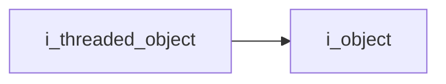
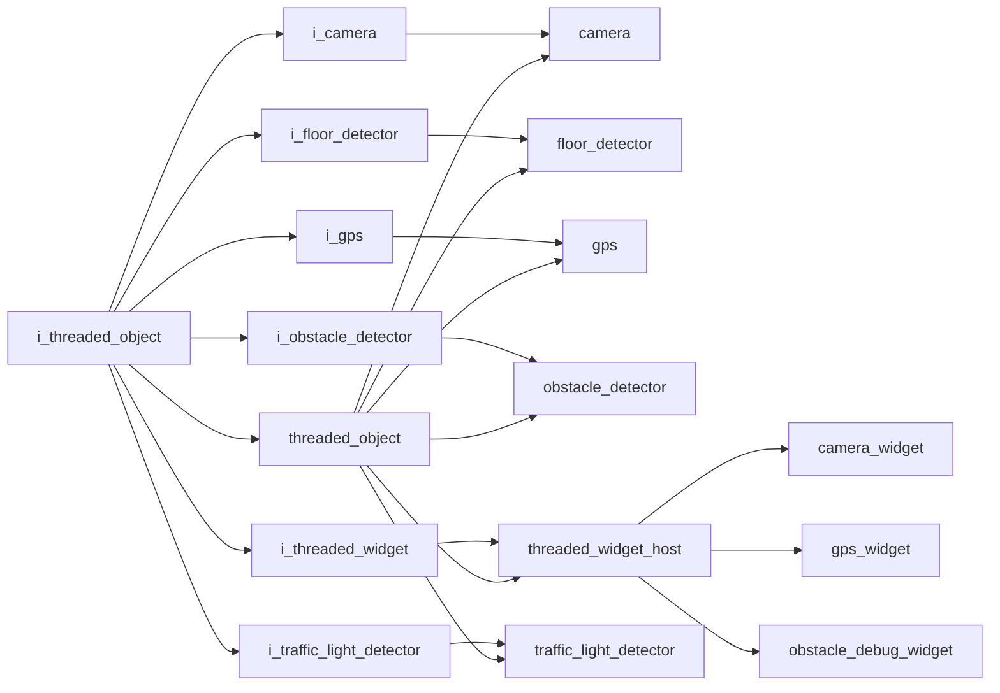

# Threaded Object Interface

- **Interface**: `i_threaded_object`
- **Namespace**: `acs::core`
- **Include**: `#include "core/interfaces/i_threaded_object.h"`

## Overview

Interface for components that execute periodic work on a managed background thread.

## Inheritance Diagram

### Base Diagram



### Derived Diagram



## Inheritance Hierarchy

### Base Hierarchy

- [`i_threaded_object`](i_threaded_object.md)
  - [`i_object`](i_object.md)

### Derived Hierarchy

- [`i_threaded_object`](i_threaded_object.md)
  - [`i_camera`](../../vision/interfaces/i_camera.md)
    - [`camera`](../../vision/implementations/camera.md)
  - [`i_floor_detector`](../../vision/interfaces/i_floor_detector.md)
    - [`floor_detector`](../../vision/implementations/floor_detector.md)
  - [`i_gps`](../../utility/interfaces/i_gps.md)
    - [`gps`](../../utility/implementations/gps.md)
  - [`i_obstacle_detector`](../../vision/interfaces/i_obstacle_detector.md)
    - [`obstacle_detector`](../../vision/implementations/obstacle_detector.md)
  - [`i_threaded_widget`](../../gui/interfaces/i_threaded_widget.md)
    - [`threaded_widget_host`](../../gui/implementations/threaded_widget_host.md)
      - [`camera_widget`](../../gui/implementations/widgets/camera_widget.md)
      - [`gps_widget`](../../gui/implementations/widgets/gps_widget.md)
      - [`obstacle_debug_widget`](../../gui/implementations/widgets/obstacle_debug_widget.md)
  - [`i_traffic_light_detector`](../../vision/interfaces/i_traffic_light_detector.md)
    - [`traffic_light_detector`](../../vision/implementations/traffic_light_detector.md)
  - [`threaded_object`](../implementations/threaded_object.md)
    - [`camera`](../../vision/implementations/camera.md)
    - [`floor_detector`](../../vision/implementations/floor_detector.md)
    - [`gps`](../../utility/implementations/gps.md)
    - [`obstacle_detector`](../../vision/implementations/obstacle_detector.md)
    - [`threaded_widget_host`](../../gui/implementations/threaded_widget_host.md)
      - [`camera_widget`](../../gui/implementations/widgets/camera_widget.md)
      - [`gps_widget`](../../gui/implementations/widgets/gps_widget.md)
      - [`obstacle_debug_widget`](../../gui/implementations/widgets/obstacle_debug_widget.md)
    - [`traffic_light_detector`](../../vision/implementations/traffic_light_detector.md)

## API

### Public Methods
#### Start

```cpp
virtual void start() = 0;
```
Starts the component's background update loop.

!!! note
    Pure virtual method, must be implemented by derived classes.
#### Stop

```cpp
virtual void stop() = 0;
```
Stops the component's background update loop and joins associated worker resources.

!!! note
    Pure virtual method, must be implemented by derived classes.
#### Get Update Rate

```cpp
[[nodiscard]] virtual float get_update_rate() const noexcept = 0;
```
Returns the configured update-loop frequency in Hz.

!!! note
    Pure virtual method, must be implemented by derived classes.
#### Set Update Rate

```cpp
virtual void set_update_rate(float update_rate) = 0;
```
Updates the target update-loop frequency in Hz.

##### Parameters
- `update_rate` (`float`): New update-loop frequency in Hz.

!!! note
    Pure virtual method, must be implemented by derived classes.
#### Get Is Running

```cpp
[[nodiscard]] virtual bool get_is_running() const noexcept = 0;
```
Returns whether the background update loop is currently running.

!!! note
    Pure virtual method, must be implemented by derived classes.
