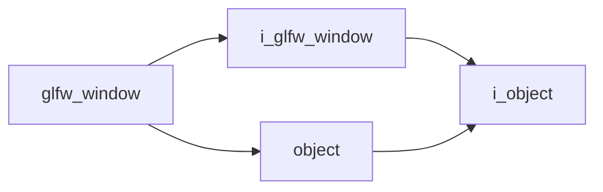

# Glfw Window

- **Class**: `glfw_window`
- **Namespace**: `acs::gui`
- **Include**: `#include "gui/implementations/glfw_window.h"`

## Overview

Concrete implementation of `i_glfw_window`.

## Inheritance Diagram

### Base Diagram



## Inheritance Hierarchy

### Base Hierarchy

- [`glfw_window`](glfw_window.md)
  - [`i_glfw_window`](../interfaces/i_glfw_window.md)
    - [`i_object`](../../core/interfaces/i_object.md)
  - [`object`](../../core/implementations/object.md)
    - [`i_object`](../../core/interfaces/i_object.md)

## API

### Constructors
#### Constructor

```cpp
glfw_window(std::string_view tag, const parameters_t& parameters);
```
Creates a glfw window with the specified name.

##### Parameters
- `tag`: The tag.
- `parameters`: The parameters.

### Public Methods

#### Implementations
- [`i_glfw_window`](../interfaces/i_glfw_window.md)
    - [`get_window_ptr`](../interfaces/i_glfw_window.md#get-window-pointer)
