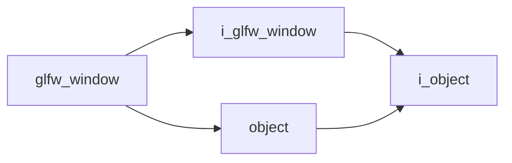

# Glfw Window

- **Class**: `glfw_window`
- **Namespace**: `acs::gui`
- **Include**: `#include "gui/implementations/glfw_window.h"`

## Overview

Concrete `i_glfw_window` implementation that owns the native GLFW window and applies window/runtime options from project configuration.

## Inheritance Diagram

### Base Diagram



## Inheritance Hierarchy

### Base Hierarchy

- [`glfw_window`](glfw_window.md)
  - [`i_glfw_window`](../interfaces/i_glfw_window.md)
    - [`i_object`](../../core/interfaces/i_object.md)
  - [`object`](../../core/implementations/object.md)
    - [`i_object`](../../core/interfaces/i_object.md)

## API

### Constructors
#### Constructor

```cpp
explicit glfw_window(const parameters& parameters);
```
Creates a GLFW window wrapper from the provided runtime window parameters.

##### Parameters
- `parameters` (`const parameters&`): Window configuration bundle (size, title behavior, context options, and related GLFW settings).

### Nested Types

#### Structs
##### Parameters

```cpp
struct parameters {
  std::string_view title;
  int width;
  int height;
  bool start_maximized;
  bool enable_vsync;
};
```
Window initialization options.

- `title` (`std::string_view`): Window title.
- `width` (`int`): Window width.
- `height` (`int`): Window height.
- `start_maximized` (`bool`): Start maximized.
- `enable_vsync` (`bool`): Enable VSync.

### Public Methods

#### Implementations
- [`i_glfw_window`](../interfaces/i_glfw_window.md)
    - [`get_window_ptr`](../interfaces/i_glfw_window.md#get-window-pointer)
