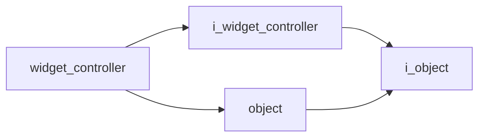

# Widget Controller

- **Class**: `widget_controller`
- **Namespace**: `acs::gui`
- **Include**: `#include "gui/implementations/widget_controller.h"`

## Overview

Concrete `i_widget_controller` implementation that owns widget registrations and orchestrates per-frame UI rendering order.

## Inheritance Diagram

### Base Diagram



## Inheritance Hierarchy

### Base Hierarchy

- [`widget_controller`](widget_controller.md)
  - [`i_widget_controller`](../interfaces/i_widget_controller.md)
    - [`i_object`](../../core/interfaces/i_object.md)
  - [`object`](../../core/implementations/object.md)
    - [`i_object`](../../core/interfaces/i_object.md)

## API

### Constructors
#### Default Constructor

```cpp
widget_controller();
```
Creates a widget controller that manages widget registration and render dispatch.

### Public Methods

#### Implementations
- [`i_widget_controller`](../interfaces/i_widget_controller.md)
    - [`register_widget`](../interfaces/i_widget_controller.md#register-widget)
    - [`register_threaded_widget`](../interfaces/i_widget_controller.md#register-threaded-widget)
    - [`render`](../interfaces/i_widget_controller.md#render)
    - [`stop_all_threaded_widgets`](../interfaces/i_widget_controller.md#stop-all-threaded-widgets)
