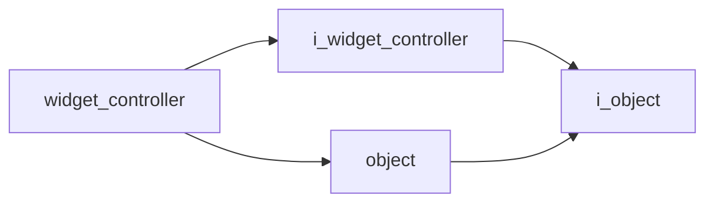

# Widget Controller

- **Class**: `widget_controller`
- **Namespace**: `acs::gui`
- **Include**: `#include "gui/implementations/widget_controller.h"`

## Overview

Concrete implementation of `i_widget_controller`.

## Inheritance Diagram

### Base Diagram



## Inheritance Hierarchy

### Base Hierarchy

- [`widget_controller`](widget_controller.md)
  - [`i_widget_controller`](../interfaces/i_widget_controller.md)
    - [`i_object`](../../core/interfaces/i_object.md)
  - [`object`](../../core/implementations/object.md)
    - [`i_object`](../../core/interfaces/i_object.md)

## API

### Constructors
#### Constructor

```cpp
explicit widget_controller(std::string_view tag);
```
Creates a widget controller with the specified name.

##### Parameters
- `tag`: The tag.

### Public Methods

#### Implementations
- [`i_widget_controller`](../interfaces/i_widget_controller.md)
    - [`register_widget`](../interfaces/i_widget_controller.md#register-widget)
    - [`register_threaded_widget`](../interfaces/i_widget_controller.md#register-threaded-widget)
    - [`render`](../interfaces/i_widget_controller.md#render)
