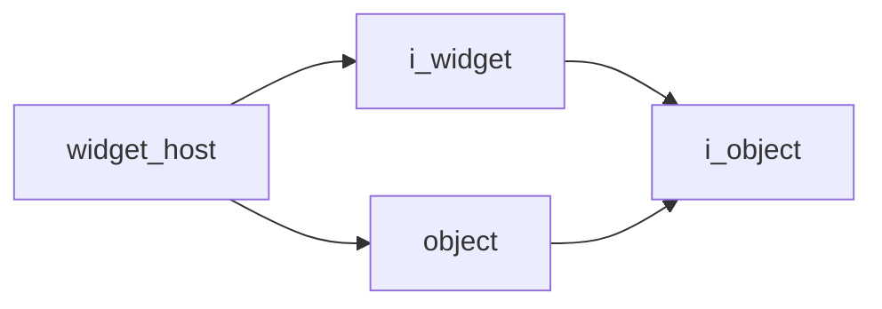

# Widget Host

- **Class**: `widget_host`
- **Namespace**: `acs::gui`
- **Include**: `#include "gui/implementations/widget_host.h"`

## Overview

Concrete implementation of `i_widget`.

## Inheritance Diagram

### Base Diagram



### Derived Diagram


## Inheritance Hierarchy

### Base Hierarchy

- [`widget_host`](widget_host.md)
  - [`i_widget`](../interfaces/i_widget.md)
    - [`i_object`](../../core/interfaces/i_object.md)
  - [`object`](../../core/implementations/object.md)
    - [`i_object`](../../core/interfaces/i_object.md)

### Derived Hierarchy

- [`widget_host`](widget_host.md)
  - [`about_widget`](widgets/about_widget.md)

## API

### Constructors
#### Constructor

```cpp
widget_host(std::string_view tag, std::string_view title);
```
Creates a widget host with the specified name.

##### Parameters
- `tag`: The tag.
- `title`: The title.

### Public Methods

#### Implementations
- [`i_widget`](../interfaces/i_widget.md)
    - [`render`](../interfaces/i_widget.md#render)
    - [`get_title`](../interfaces/i_widget.md#get-title)
    - [`get_is_open_ref`](../interfaces/i_widget.md#get-is-open-reference)

### Protected Methods
#### On Render

```cpp
virtual void on_render() = 0;
```

!!! note
    Pure virtual method, must be implemented by derived classes.
