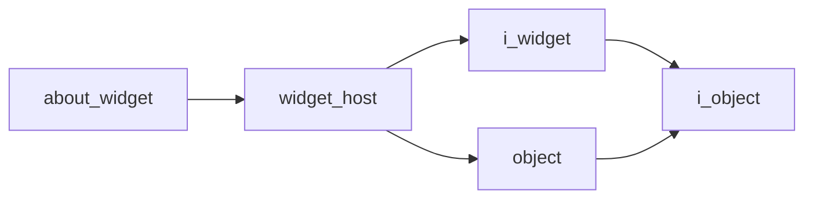

# About Widget

- **Class**: `about_widget`
- **Namespace**: `acs::gui`
- **Include**: `#include "gui/implementations/widgets/about_widget.h"`

## Overview

About Widget.

## Inheritance Diagram

### Base Diagram



## Inheritance Hierarchy

### Base Hierarchy

- [`about_widget`](about_widget.md)
  - [`widget_host`](../widget_host.md)
    - [`i_widget`](../../interfaces/i_widget.md)
      - [`i_object`](../../../core/interfaces/i_object.md)
    - [`object`](../../../core/implementations/object.md)
      - [`i_object`](../../../core/interfaces/i_object.md)

## API

### Constructors
#### Constructor

```cpp
about_widget(std::string_view tag, std::string_view title);
```
Creates an about widget with the specified name.

##### Parameters
- `tag`: The tag.
- `title`: The title.

### Protected Methods
#### On Render

```cpp
void on_render() override;
```
