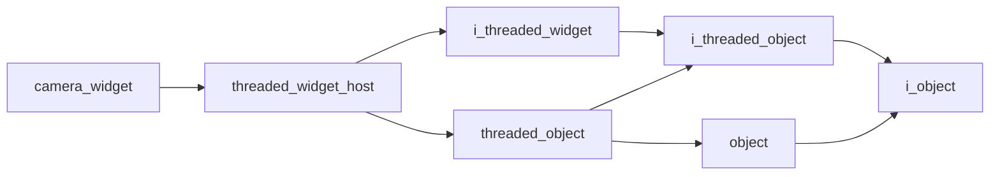

# Camera Widget

- **Class**: `camera_widget`
- **Namespace**: `acs::gui`
- **Include**: `#include "gui/implementations/widgets/camera_widget.h"`

## Overview

Concrete `threaded_widget_host` implementation that visualizes live camera outputs and related stream diagnostics.

## Inheritance Diagram

### Base Diagram



## Inheritance Hierarchy

### Base Hierarchy

- [`camera_widget`](camera_widget.md)
  - [`threaded_widget_host`](../threaded_widget_host.md)
    - [`i_threaded_widget`](../../interfaces/i_threaded_widget.md)
      - [`i_threaded_object`](../../../core/interfaces/i_threaded_object.md)
        - [`i_object`](../../../core/interfaces/i_object.md)
    - [`threaded_object`](../../../core/implementations/threaded_object.md)
      - [`i_threaded_object`](../../../core/interfaces/i_threaded_object.md)
        - [`i_object`](../../../core/interfaces/i_object.md)
      - [`object`](../../../core/implementations/object.md)
        - [`i_object`](../../../core/interfaces/i_object.md)

## API

### Constructors
#### Constructor

```cpp
camera_widget(float update_rate, std::shared_ptr<vision::i_camera> camera);
```
Creates a camera widget bound to a camera source and periodic refresh loop.

##### Parameters
- `update_rate` (`float`): Requested widget update frequency in Hz for refreshing camera-derived content.
- `camera` (`std::shared_ptr<vision::i_camera>`): Shared camera dependency that provides the latest frames and camera status data.

### Protected Methods
#### Update

```cpp
void update() override;
```
Refreshes cached camera-derived view state used by the widget renderer.
#### On Render

```cpp
void on_render() override;
```
Draws camera imagery and related diagnostic overlays in the widget UI.
