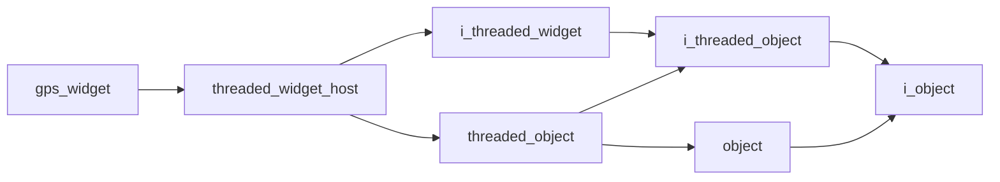

# Gps Widget

- **Class**: `gps_widget`
- **Namespace**: `acs::gui`
- **Include**: `#include "gui/implementations/widgets/gps_widget.h"`

## Overview

Concrete `threaded_widget_host` implementation that visualizes live GPS position, heading, and navigation preview state from runtime services.

## Inheritance Diagram

### Base Diagram



## Inheritance Hierarchy

### Base Hierarchy

- [`gps_widget`](gps_widget.md)
  - [`threaded_widget_host`](../threaded_widget_host.md)
    - [`i_threaded_widget`](../../interfaces/i_threaded_widget.md)
      - [`i_threaded_object`](../../../core/interfaces/i_threaded_object.md)
        - [`i_object`](../../../core/interfaces/i_object.md)
    - [`threaded_object`](../../../core/implementations/threaded_object.md)
      - [`i_threaded_object`](../../../core/interfaces/i_threaded_object.md)
        - [`i_object`](../../../core/interfaces/i_object.md)
      - [`object`](../../../core/implementations/object.md)
        - [`i_object`](../../../core/interfaces/i_object.md)

## API

### Constructors
#### Constructor

```cpp
gps_widget(float update_rate, std::shared_ptr<utility::i_gps> gps, std::shared_ptr<logic::state_machine> state_machine);
```
Creates a GPS widget bound to GPS and state-machine dependencies with a periodic refresh loop.

##### Parameters
- `update_rate` (`float`): Requested widget update frequency in Hz for refreshing GPS and navigation preview data.
- `gps` (`std::shared_ptr<utility::i_gps>`): Shared GPS dependency that provides the latest parsed position and heading inputs.
- `state_machine` (`std::shared_ptr<logic::state_machine>`): Shared state-machine dependency that provides navigation preview values rendered by the widget.

### Protected Methods
#### Update

```cpp
void update() override;
```
Refreshes cached GPS and navigation preview state used by the widget renderer.
#### On Render

```cpp
void on_render() override;
```
Draws GPS and navigation preview diagnostics in the widget UI.
