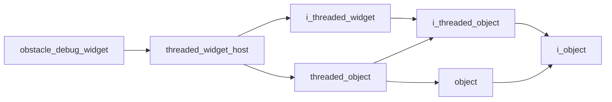

# Obstacle Debug Widget

- **Class**: `obstacle_debug_widget`
- **Namespace**: `acs::gui`
- **Include**: `#include "gui/implementations/widgets/obstacle_debug_widget.h"`

## Overview

Concrete `threaded_widget_host` implementation that visualizes obstacle-detection debug data, including union regions and zone-level occupancy results.

## Inheritance Diagram

### Base Diagram



## Inheritance Hierarchy

### Base Hierarchy

- [`obstacle_debug_widget`](obstacle_debug_widget.md)
  - [`threaded_widget_host`](../threaded_widget_host.md)
    - [`i_threaded_widget`](../../interfaces/i_threaded_widget.md)
      - [`i_threaded_object`](../../../core/interfaces/i_threaded_object.md)
        - [`i_object`](../../../core/interfaces/i_object.md)
    - [`threaded_object`](../../../core/implementations/threaded_object.md)
      - [`i_threaded_object`](../../../core/interfaces/i_threaded_object.md)
        - [`i_object`](../../../core/interfaces/i_object.md)
      - [`object`](../../../core/implementations/object.md)
        - [`i_object`](../../../core/interfaces/i_object.md)

## API

### Constructors
#### Constructor

```cpp
obstacle_debug_widget(float update_rate,
                      std::shared_ptr<vision::i_camera> camera_ptr,
                      std::shared_ptr<vision::i_obstacle_detector> obstacle_detector_ptr,
                      std::shared_ptr<vision::i_floor_detector> floor_detector_ptr);
```
Creates an obstacle debug widget bound to camera and obstacle-detector dependencies with a periodic refresh loop.

##### Parameters
- `update_rate` (`float`): Requested widget update frequency in Hz for refreshing obstacle diagnostics.
- `camera_ptr` (`std::shared_ptr<vision::i_camera>`): Shared camera dependency that provides the latest imagery used by the diagnostic view.
- `obstacle_detector_ptr` (`std::shared_ptr<vision::i_obstacle_detector>`): Shared obstacle-detector dependency that provides zone and union-detection outputs.
- `floor_detector_ptr` (`std::shared_ptr<vision::i_floor_detector>`): Shared floor-detector dependency that provides the latest estimated floor plane for obstacle-context visualization.

### Protected Methods
#### Update

```cpp
void update() override;
```
Refreshes cached obstacle-analysis state used by the widget renderer.
#### On Render

```cpp
void on_render() override;
```
Draws obstacle diagnostics, including zone overlays and union obstacle previews, in the widget UI.
