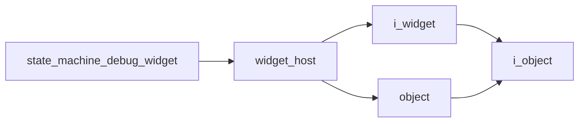

# State Machine Debug Widget

- **Class**: `state_machine_debug_widget`
- **Namespace**: `acs::gui`
- **Include**: `#include "gui/implementations/widgets/state_machine_debug_widget.h"`

## Overview

Concrete `widget_host` implementation that renders current runtime behavior state and navigation debug details from the state machine.

## Inheritance Diagram

### Base Diagram



## Inheritance Hierarchy

### Base Hierarchy

- [`state_machine_debug_widget`](state_machine_debug_widget.md)
  - [`widget_host`](../widget_host.md)
    - [`i_widget`](../../interfaces/i_widget.md)
      - [`i_object`](../../../core/interfaces/i_object.md)
    - [`object`](../../../core/implementations/object.md)
      - [`i_object`](../../../core/interfaces/i_object.md)

## API

### Constructors
#### Constructor

```cpp
explicit state_machine_debug_widget(std::shared_ptr<logic::state_machine> state_machine_ptr);
```
Creates a state-machine debug widget bound to a state-machine dependency.

##### Parameters
- `state_machine_ptr` (`std::shared_ptr<logic::state_machine>`): Shared state-machine dependency that provides the latest state and navigation preview values for display.

### Protected Methods
#### On Render

```cpp
void on_render() override;
```
Draws state-machine status and related debug details in the widget UI.
