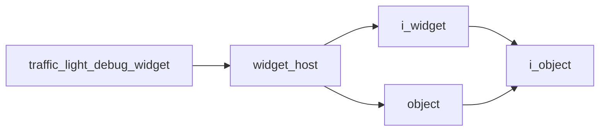

# Traffic Light Debug Widget

- **Class**: `traffic_light_debug_widget`
- **Namespace**: `acs::gui`
- **Include**: `#include "gui/implementations/widgets/traffic_light_debug_widget.h"`

## Overview

Concrete `widget_host` implementation that renders current traffic-light detection state and related debug indicators in the GUI.

## Inheritance Diagram

### Base Diagram



## Inheritance Hierarchy

### Base Hierarchy

- [`traffic_light_debug_widget`](traffic_light_debug_widget.md)
  - [`widget_host`](../widget_host.md)
    - [`i_widget`](../../interfaces/i_widget.md)
      - [`i_object`](../../../core/interfaces/i_object.md)
    - [`object`](../../../core/implementations/object.md)
      - [`i_object`](../../../core/interfaces/i_object.md)

## API

### Constructors
#### Constructor

```cpp
traffic_light_debug_widget(const std::shared_ptr<vision::i_traffic_light_detector> &traffic_light_detector);
```
Creates a traffic-light debug widget bound to a traffic-light detector dependency.

##### Parameters
- `traffic_light_detector` (`const std::shared_ptr<vision::i_traffic_light_detector> &`): Shared traffic-light detector dependency that provides the latest inferred signal state for display.

### Protected Methods
#### On Render

```cpp
void on_render() override;
```
Draws traffic-light detection state and related debug information in the widget UI.
