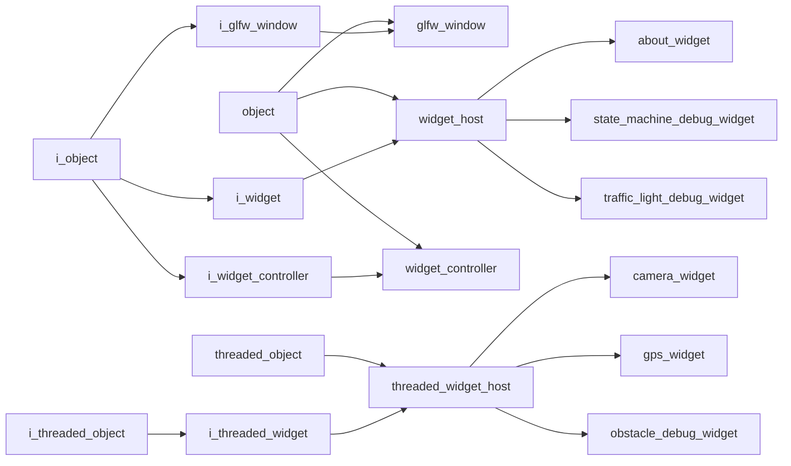

# GUI Namespace

## Overview

The `acs::gui` namespace contains GUI objects and interfaces used to host windows, register widgets, and render runtime visualization views.

## Namespace Contents

### Interfaces

- [i_glfw_window](interfaces/i_glfw_window.md)
- [i_threaded_widget](interfaces/i_threaded_widget.md)
- [i_widget](interfaces/i_widget.md)
- [i_widget_controller](interfaces/i_widget_controller.md)

### Implementations

- [about_widget](implementations/widgets/about_widget.md)
- [camera_widget](implementations/widgets/camera_widget.md)
- [glfw_window](implementations/glfw_window.md)
- [gps_widget](implementations/widgets/gps_widget.md)
- [obstacle_debug_widget](implementations/widgets/obstacle_debug_widget.md)
- [state_machine_debug_widget](implementations/widgets/state_machine_debug_widget.md)
- [threaded_widget_host](implementations/threaded_widget_host.md)
- [traffic_light_debug_widget](implementations/widgets/traffic_light_debug_widget.md)
- [widget_controller](implementations/widget_controller.md)
- [widget_host](implementations/widget_host.md)

## Inheritance Hierarchy

