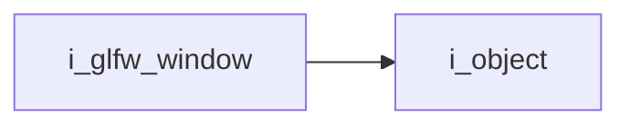
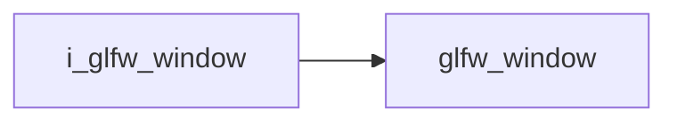

# Glfw Window Interface

- **Interface**: `i_glfw_window`
- **Namespace**: `acs::gui`
- **Include**: `#include "gui/interfaces/i_glfw_window.h"`

## Overview

Interface for glfw window.

## Inheritance Diagram

### Base Diagram



### Derived Diagram



## Inheritance Hierarchy

### Base Hierarchy

- [`i_glfw_window`](i_glfw_window.md)
  - [`i_object`](../../core/interfaces/i_object.md)

### Derived Hierarchy

- [`i_glfw_window`](i_glfw_window.md)
  - [`glfw_window`](../implementations/glfw_window.md)

## API

### Public Methods
#### Get Window Pointer

```cpp
[[nodiscard]] virtual GLFWwindow* get_window_ptr() const noexcept = 0;
```
Returns the window pointer.

!!! note
    Pure virtual method, must be implemented by derived classes.
