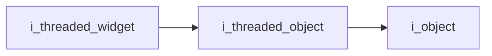
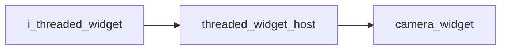

# Threaded Widget Interface

- **Interface**: `i_threaded_widget`
- **Namespace**: `acs::gui`
- **Include**: `#include "gui/interfaces/i_threaded_widget.h"`

## Overview

Interface that defines the render contract for widgets that also run periodic threaded updates.

## Inheritance Diagram

### Base Diagram



### Derived Diagram



## Inheritance Hierarchy

### Base Hierarchy

- [`i_threaded_widget`](i_threaded_widget.md)
  - [`i_threaded_object`](../../core/interfaces/i_threaded_object.md)
    - [`i_object`](../../core/interfaces/i_object.md)

### Derived Hierarchy

- [`i_threaded_widget`](i_threaded_widget.md)
  - [`threaded_widget_host`](../implementations/threaded_widget_host.md)
    - [`camera_widget`](../implementations/widgets/camera_widget.md)

## API

### Public Methods
#### Render

```cpp
virtual void render() = 0;
```

!!! note
    Pure virtual method, must be implemented by derived classes.
#### Get Title

```cpp
[[nodiscard]] virtual std::string_view get_title() const noexcept = 0;
```
Returns the display title used when rendering the widget container.

!!! note
    Pure virtual method, must be implemented by derived classes.
#### Get Is Open Reference

```cpp
[[nodiscard]] virtual bool& get_is_open_ref() noexcept = 0;
```
Returns a mutable reference to the widget visibility flag.

!!! note
    Pure virtual method, must be implemented by derived classes.
