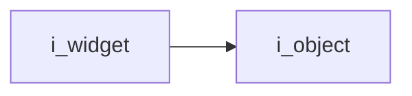
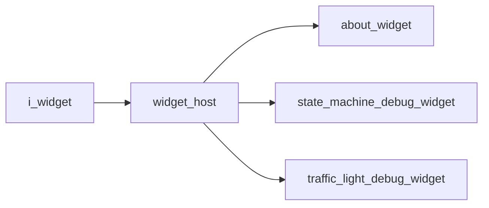

# Widget Interface

- **Interface**: `i_widget`
- **Namespace**: `acs::gui`
- **Include**: `#include "gui/interfaces/i_widget.h"`

## Overview

Interface that defines the minimal render contract for GUI widgets.

## Inheritance Diagram

### Base Diagram



### Derived Diagram



## Inheritance Hierarchy

### Base Hierarchy

- [`i_widget`](i_widget.md)
  - [`i_object`](../../core/interfaces/i_object.md)

### Derived Hierarchy

- [`i_widget`](i_widget.md)
  - [`widget_host`](../implementations/widget_host.md)
    - [`about_widget`](../implementations/widgets/about_widget.md)
    - [`state_machine_debug_widget`](../implementations/widgets/state_machine_debug_widget.md)
    - [`traffic_light_debug_widget`](../implementations/widgets/traffic_light_debug_widget.md)

## API

### Public Methods
#### Render

```cpp
virtual void render() = 0;
```

!!! note
    Pure virtual method, must be implemented by derived classes.
#### Get Title

```cpp
[[nodiscard]] virtual std::string_view get_title() const noexcept = 0;
```
Returns the display title used when rendering the widget container.

!!! note
    Pure virtual method, must be implemented by derived classes.
#### Get Is Open Reference

```cpp
[[nodiscard]] virtual bool& get_is_open_ref() noexcept = 0;
```
Returns a mutable reference to the widget visibility flag.

!!! note
    Pure virtual method, must be implemented by derived classes.
