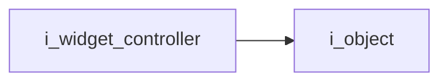

# Widget Controller Interface

- **Interface**: `i_widget_controller`
- **Namespace**: `acs::gui`
- **Include**: `#include "gui/interfaces/i_widget_controller.h"`

## Overview

Interface for widget controller.

## Inheritance Diagram

### Base Diagram



### Derived Diagram


## Inheritance Hierarchy

### Base Hierarchy

- [`i_widget_controller`](i_widget_controller.md)
  - [`i_object`](../../core/interfaces/i_object.md)

### Derived Hierarchy

- [`i_widget_controller`](i_widget_controller.md)
  - [`widget_controller`](../implementations/widget_controller.md)

## API

### Public Methods
#### Register Widget

```cpp
virtual void register_widget(std::unique_ptr<i_widget> widget_ptr) = 0;
```

##### Parameters
- `widget_ptr`: The widget pointer.

!!! note
    Pure virtual method, must be implemented by derived classes.
#### Register Threaded Widget

```cpp
virtual void register_threaded_widget(std::unique_ptr<i_threaded_widget> widget_ptr) = 0;
```

##### Parameters
- `widget_ptr`: The widget pointer.

!!! note
    Pure virtual method, must be implemented by derived classes.
#### Render

```cpp
virtual void render() = 0;
```

!!! note
    Pure virtual method, must be implemented by derived classes.
