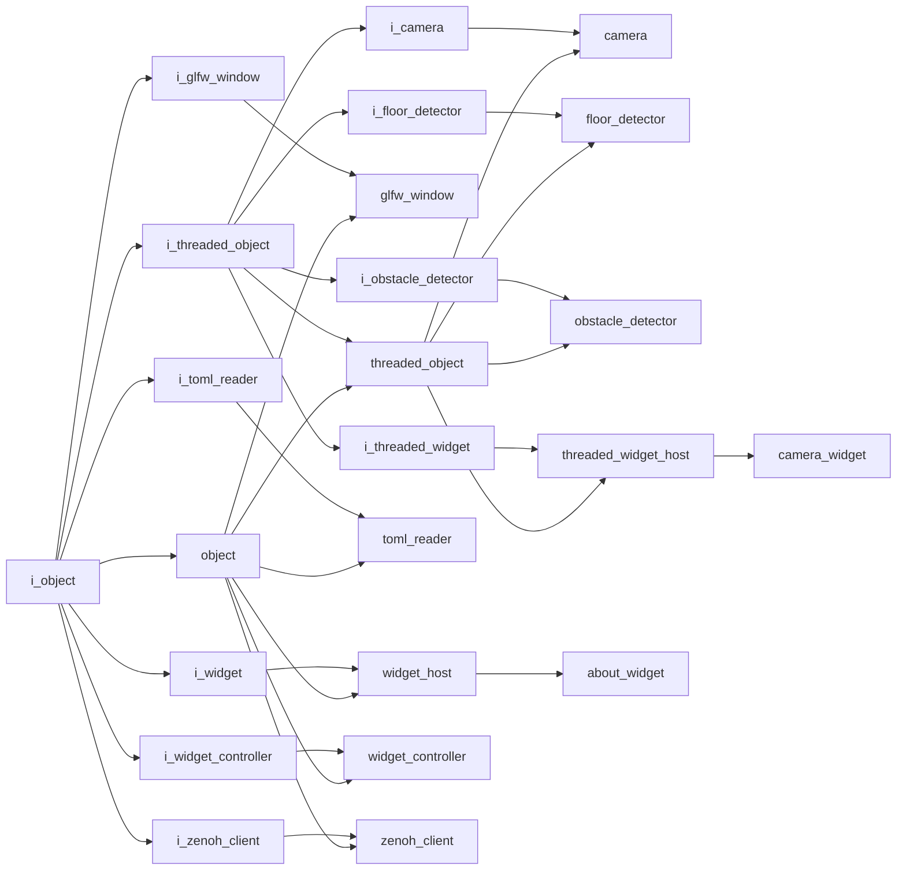

# Namespaces

This page indexes the namespace documentation and the project-wide inheritance graph.

## Namespace Pages

- [Core](core/index.md)
- [Gui](gui/index.md)
- [Opengl](opengl/index.md)
- [Utility](utility/index.md)
- [Vision](vision/index.md)

## Inheritance Graph

