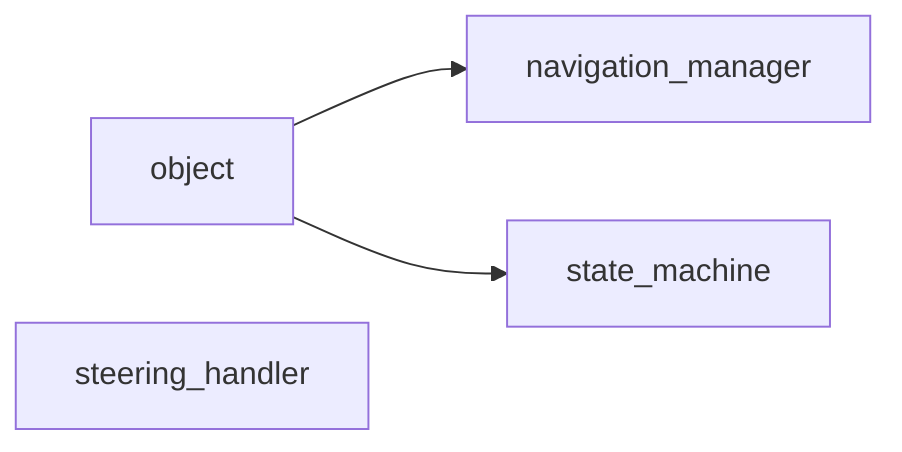

# Logic Namespace

## Overview

The `acs::logic` namespace contains navigation and behavior coordination components that consume perception and GPS inputs to produce steering and runtime state decisions.

## Namespace Contents

### Implementations

- [navigation_manager](navigation_manager.md)
- [state_machine](state_machine.md)
- [steering_handler](steering_handler.md)

## Inheritance Hierarchy

