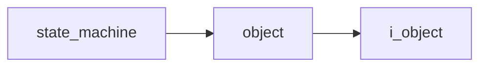

# State Machine

- **Class**: `state_machine`
- **Namespace**: `acs::logic`
- **Include**: `#include "logic/state_machine.h"`

## Overview

Runtime behavior state machine that coordinates driving decisions using navigation preview, obstacle context, and traffic-light detection inputs.

## Inheritance Diagram

### Base Diagram



## Inheritance Hierarchy

### Base Hierarchy

- [`state_machine`](state_machine.md)
  - [`object`](../core/implementations/object.md)
    - [`i_object`](../core/interfaces/i_object.md)

## API

### Constructors
#### Constructor

```cpp
state_machine(std::shared_ptr<utility::i_gps> gps_ptr,
              std::shared_ptr<utility::i_zenoh_client> zenoh_client_ptr,
              std::shared_ptr<vision::i_obstacle_detector> obstacle_detector_ptr,
              std::shared_ptr<vision::i_traffic_light_detector> traffic_light_detector_ptr,
              const parameters_t& parameters);
```
Creates a state machine with GPS, Zenoh, obstacle, and traffic-light dependencies plus runtime parameters.

##### Parameters
- `gps_ptr` (`std::shared_ptr<utility::i_gps>`): Shared GPS dependency that provides current position/heading inputs.
- `zenoh_client_ptr` (`std::shared_ptr<utility::i_zenoh_client>`): Shared Zenoh client used to publish control outputs.
- `obstacle_detector_ptr` (`std::shared_ptr<vision::i_obstacle_detector>`): Shared obstacle-detector dependency used for obstacle context.
- `traffic_light_detector_ptr` (`std::shared_ptr<vision::i_traffic_light_detector>`): Shared traffic-light detector dependency used for signal-state decisions.
- `parameters` (`const parameters_t&`): State-machine configuration bundle containing route, control-topic, and steering parameters.

### Nested Types

#### Enums
##### States E

```cpp
enum class states_e : uint8_t {
  driving,
  stopped_at_red_light,
};
```
Behavior states used by the runtime control loop.

###### Values
- `driving`: Normal driving state.
- `stopped_at_red_light`: Stopped state enforced by red-light detection.

#### Structs
##### Parameters T

```cpp
struct parameters_t {
  std::string_view track_file;
  std::string_view motor_speed_zenoh_topic;
  std::string_view steering_angle_zenoh_topic;
  float default_motor_speed;
  double lookahead_dist;
  double steering_gain;
  double wheelbase;
};
```
State-machine configuration values for route following and control publishing.

- `track_file` (`std::string_view`): Path to the route/track file to load.
- `motor_speed_zenoh_topic` (`std::string_view`): Zenoh key expression/topic used to publish motor speed commands.
- `steering_angle_zenoh_topic` (`std::string_view`): Zenoh key expression/topic used to publish steering commands.
- `default_motor_speed` (`float`): Default motor speed command used while driving.
- `lookahead_dist` (`double`): Forward lookahead distance in meters used by steering logic.
- `steering_gain` (`double`): Gain applied to steering response.
- `wheelbase` (`double`): Vehicle wheelbase in meters used for steering geometry.

### Public Methods
#### Update

```cpp
void update();
```
Runs one state-machine update cycle, evaluating inputs and publishing current control outputs.
#### Set State

```cpp
void set_state(states_e state);
```
Forces the state machine into the specified behavior state.

##### Parameters
- `state` (`states_e`): Target behavior state to apply.
#### Get State

```cpp
[[nodiscard]] states_e get_state() const;
```
Returns the current behavior state.
#### Get Navigation Preview

```cpp
[[nodiscard]] navigation_manager::preview_t get_navigation_preview() const;
```
Returns the latest navigation preview produced by the underlying navigation manager.
