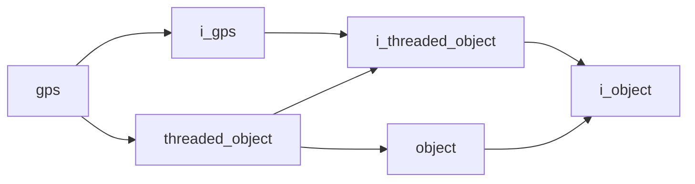

# Gps

- **Class**: `gps`
- **Namespace**: `acs::utility`
- **Include**: `#include "utility/implementations/gps.h"`

## Overview

Concrete `i_gps` implementation that reads NMEA and UBX input from a serial GPS receiver, converts positions for downstream consumers, and exposes the latest parsed fix.

## Inheritance Diagram

### Base Diagram



## Inheritance Hierarchy

### Base Hierarchy

- [`gps`](gps.md)
  - [`i_gps`](../interfaces/i_gps.md)
    - [`i_threaded_object`](../../core/interfaces/i_threaded_object.md)
      - [`i_object`](../../core/interfaces/i_object.md)
  - [`threaded_object`](../../core/implementations/threaded_object.md)
    - [`i_threaded_object`](../../core/interfaces/i_threaded_object.md)
      - [`i_object`](../../core/interfaces/i_object.md)
    - [`object`](../../core/implementations/object.md)
      - [`i_object`](../../core/interfaces/i_object.md)

## API

### Constructors
#### Constructor

```cpp
explicit gps(float update_rate, const parameters_t& params);
```
Creates a GPS reader configured for a serial device and its communication settings.

##### Parameters
- `update_rate` (`float`): Requested update-loop frequency in Hz for serial polling and parser updates.
- `params` (`const parameters_t&`): GPS reader configuration bundle (serial port name and baud rate).

### Nested Types

#### Structs
##### Parameters T

```cpp
struct parameters_t {
  std::string port_name;
  int baud_rate;
  std::string source_epsg;
  std::string target_epsg;
};
```
GPS reader configuration values used to open the receiver connection and coordinate-frame conversion.

- `port_name` (`std::string`): Serial port name used to reach the GPS receiver.
- `baud_rate` (`int`): Serial baud rate used for GPS communication.
- `source_epsg` (`std::string`): Source CRS/EPSG code used for incoming latitude/longitude interpretation.
- `target_epsg` (`std::string`): Target CRS/EPSG code used for converted UTM/projected coordinates.

### Public Methods

#### Implementations
- [`i_gps`](../interfaces/i_gps.md)
    - [`parse_nmea`](../interfaces/i_gps.md#parse-nmea)
    - [`parse_ubx`](../interfaces/i_gps.md#parse-ubx)
    - [`get_latest_point`](../interfaces/i_gps.md#get-latest-point)
    - [`convert_to_utm`](../interfaces/i_gps.md#convert-to-utm)

### Protected Methods
#### Update

```cpp
void update() override;
```
Performs one update cycle.
