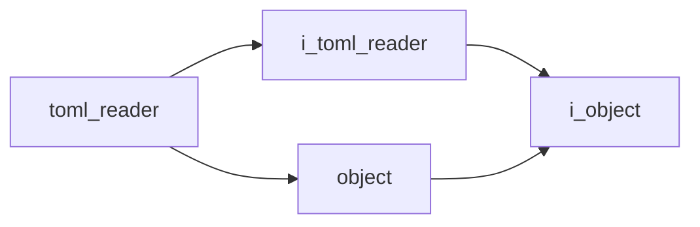

# TOML Reader

- **Class**: `toml_reader`
- **Namespace**: `acs::utility`
- **Include**: `#include "utility/implementations/toml_reader.h"`

## Overview

Concrete `i_toml_reader` implementation that loads and owns parsed TOML configuration for runtime component setup.

## Inheritance Diagram

### Base Diagram



## Inheritance Hierarchy

### Base Hierarchy

- [`toml_reader`](toml_reader.md)
  - [`i_toml_reader`](../interfaces/i_toml_reader.md)
    - [`i_object`](../../core/interfaces/i_object.md)
  - [`object`](../../core/implementations/object.md)
    - [`i_object`](../../core/interfaces/i_object.md)

## API

### Constructors
#### Constructor

```cpp
explicit toml_reader(std::string_view file_path);
```
Creates a TOML reader initialized with an initial configuration file path.

##### Parameters
- `file_path` (`std::string_view`): Path to the TOML configuration file that should be parsed.

### Public Methods

#### Implementations
- [`i_toml_reader`](../interfaces/i_toml_reader.md)
    - [`parse`](../interfaces/i_toml_reader.md#parse)
    - [`free`](../interfaces/i_toml_reader.md#free)
    - [`get_file_path`](../interfaces/i_toml_reader.md#get-file-path)
    - [`set_file_path`](../interfaces/i_toml_reader.md#set-file-path)
    - [`get_table_ref`](../interfaces/i_toml_reader.md#get-table-reference)
