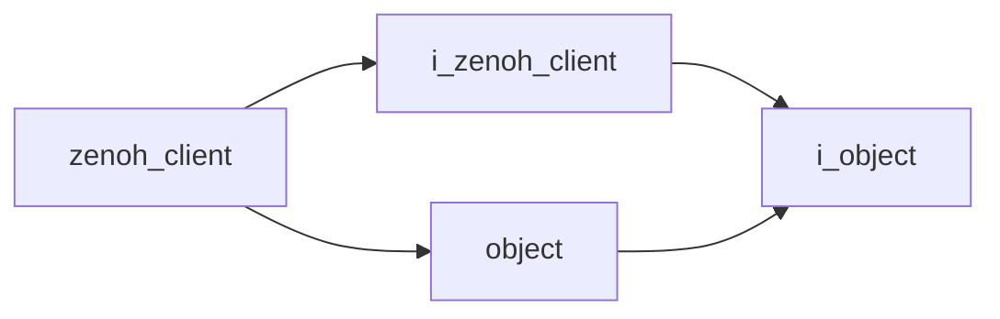

# Zenoh Client

- **Class**: `zenoh_client`
- **Namespace**: `acs::utility`
- **Include**: `#include "utility/implementations/zenoh_client.h"`

## Overview

Concrete implementation of `i_zenoh_client`.

## Inheritance Diagram

### Base Diagram



## Inheritance Hierarchy

### Base Hierarchy

- [`zenoh_client`](zenoh_client.md)
  - [`i_zenoh_client`](../interfaces/i_zenoh_client.md)
    - [`i_object`](../../core/interfaces/i_object.md)
  - [`object`](../../core/implementations/object.md)
    - [`i_object`](../../core/interfaces/i_object.md)

## API

### Constructors
#### Constructor

```cpp
zenoh_client(std::string_view tag, std::string_view address, unsigned int port);
```
Creates a zenoh client with the specified name.

##### Parameters
- `tag`: The tag.
- `address`: The address.
- `port`: The port.

### Public Methods

#### Implementations
- [`i_zenoh_client`](../interfaces/i_zenoh_client.md)
    - [`get_address`](../interfaces/i_zenoh_client.md#get-address)
    - [`set_address`](../interfaces/i_zenoh_client.md#set-address)
    - [`get_port`](../interfaces/i_zenoh_client.md#get-port)
    - [`set_port`](../interfaces/i_zenoh_client.md#set-port)
    - [`get_session_ptr`](../interfaces/i_zenoh_client.md#get-session-pointer)
    - [`get_config_ptr`](../interfaces/i_zenoh_client.md#get-config-pointer)
