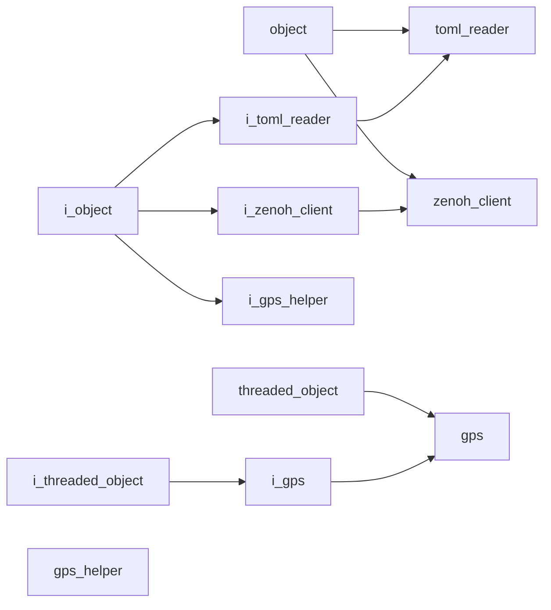

# Utility Namespace

## Overview

The `acs::utility` namespace contains utility objects and interfaces for shared services such as configuration parsing and Zenoh connectivity.

## Namespace Contents

### Interfaces

- [i_gps](interfaces/i_gps.md)
- [i_gps_helper](interfaces/i_gps_helper.md)
- [i_toml_reader](interfaces/i_toml_reader.md)
- [i_zenoh_client](interfaces/i_zenoh_client.md)

### Implementations

- [gps](implementations/gps.md)
- [gps_helper](implementations/gps_helper.md)
- [toml_reader](implementations/toml_reader.md)
- [zenoh_client](implementations/zenoh_client.md)

## Inheritance Hierarchy

