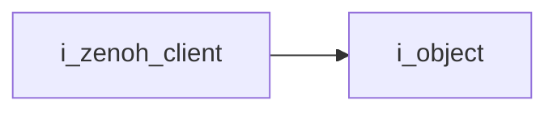
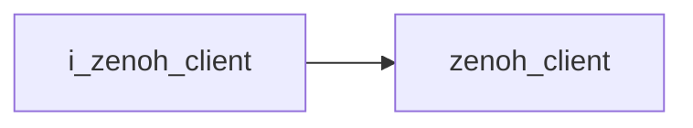

# Zenoh Client Interface

- **Interface**: `i_zenoh_client`
- **Namespace**: `acs::utility`
- **Include**: `#include "utility/interfaces/i_zenoh_client.h"`

## Overview

Interface for configuring Zenoh connection endpoints and exposing session/config handles.

## Inheritance Diagram

### Base Diagram



### Derived Diagram



## Inheritance Hierarchy

### Base Hierarchy

- [`i_zenoh_client`](i_zenoh_client.md)
  - [`i_object`](../../core/interfaces/i_object.md)

### Derived Hierarchy

- [`i_zenoh_client`](i_zenoh_client.md)
  - [`zenoh_client`](../implementations/zenoh_client.md)

## API

### Public Methods
#### Get Address

```cpp
[[nodiscard]] virtual std::string_view get_address() const = 0;
```
Returns the configured remote Zenoh endpoint address.

!!! note
    Pure virtual method, must be implemented by derived classes.
#### Set Address

```cpp
virtual void set_address(std::string_view address) = 0;
```
Updates the remote Zenoh endpoint address used for session setup.

##### Parameters
- `address` (`std::string_view`): Remote Zenoh endpoint address (hostname or IP).

!!! note
    Pure virtual method, must be implemented by derived classes.
#### Get Port

```cpp
[[nodiscard]] virtual unsigned int get_port() const = 0;
```
Returns the configured remote Zenoh endpoint port.

!!! note
    Pure virtual method, must be implemented by derived classes.
#### Set Port

```cpp
virtual void set_port(unsigned int port) = 0;
```
Updates the remote Zenoh endpoint port used for session setup.

##### Parameters
- `port` (`unsigned int`): Remote Zenoh endpoint port number.

!!! note
    Pure virtual method, must be implemented by derived classes.
#### Get Session Pointer

```cpp
[[nodiscard]] virtual zenoh::Session *get_session_ptr() const = 0;
```
Returns a pointer to the active Zenoh session object, if initialized.

!!! note
    Pure virtual method, must be implemented by derived classes.
#### Get Config Pointer

```cpp
[[nodiscard]] virtual zenoh::Config *get_config_ptr() const = 0;
```
Returns a pointer to the active Zenoh configuration object, if initialized.

!!! note
    Pure virtual method, must be implemented by derived classes.
