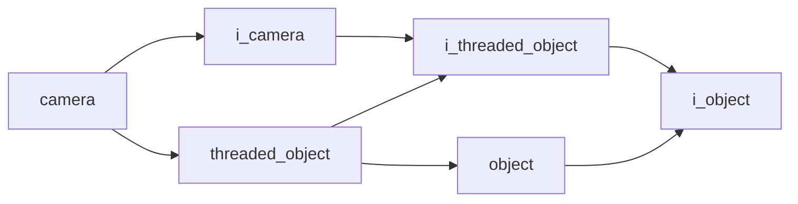

# Camera

- **Class**: `camera`
- **Namespace**: `acs::vision`
- **Include**: `#include "vision/implementations/camera.h"`

## Overview

Concrete `i_camera` implementation backed by ZED SDK capture. It acquires RGB and depth frames, tracks stream health metrics, and exposes the native camera handle for lower-level integrations.

## Inheritance Diagram

### Base Diagram



## Inheritance Hierarchy

### Base Hierarchy

- [`camera`](camera.md)
  - [`i_camera`](../interfaces/i_camera.md)
    - [`i_threaded_object`](../../core/interfaces/i_threaded_object.md)
      - [`i_object`](../../core/interfaces/i_object.md)
  - [`threaded_object`](../../core/implementations/threaded_object.md)
    - [`i_threaded_object`](../../core/interfaces/i_threaded_object.md)
      - [`i_object`](../../core/interfaces/i_object.md)
    - [`object`](../../core/implementations/object.md)
      - [`i_object`](../../core/interfaces/i_object.md)

## API

### Constructors
#### Constructor

```cpp
camera(float update_rate, const parameters_t& parameters);
```
Creates a camera component that initializes and manages the ZED capture pipeline.

##### Parameters
- `update_rate` (`float`): Requested update frequency in Hz for frame acquisition and status refresh.
- `parameters` (`const parameters_t&`): Camera configuration bundle (resolution, depth mode, runtime options, and related capture settings).

### Nested Types

#### Enums
##### Resolution T

```cpp
enum class resolution_t : uint8_t {
  vga,
  svga,
  hd720,
  hd1080
};
```
Supported camera resolution presets.

###### Values
- `vga`: VGA resolution.
- `svga`: SVGA resolution.
- `hd720`: HD720 resolution.
- `hd1080`: HD1080 resolution.
##### Depth Mode T

```cpp
enum class depth_mode_t : uint8_t {
  none,
  neural_light,
  neural,
  neural_plus,
};
```
Supported ZED depth presets.

###### Values
- `none`: No depth estimation.
- `neural_light`: Lightweight neural depth.
- `neural`: Standard neural depth.
- `neural_plus`: Highest-quality neural depth.

#### Structs
##### Parameters T

```cpp
struct parameters_t {
  resolution_t resolution;
  depth_mode_t depth_mode;
  int device_fps;
  bool enable_verbose_sdk_logging;
  float depth_minimum_distance;
  float depth_maximum_distance;
  int confidence_threshold;
  int texture_confidence_threshold;
};
```
Camera configuration values used when opening and running the stream.

- `resolution` (`resolution_t`): Capture resolution preset.
- `depth_mode` (`depth_mode_t`): Depth processing preset.
- `device_fps` (`int`): Requested device frame rate.
- `enable_verbose_sdk_logging` (`bool`): Enables verbose ZED SDK logging.
- `depth_minimum_distance` (`float`): Minimum accepted depth distance in meters.
- `depth_maximum_distance` (`float`): Maximum accepted depth distance in meters.
- `confidence_threshold` (`int`): Depth confidence cutoff.
- `texture_confidence_threshold` (`int`): Texture confidence cutoff.

### Public Methods

#### Implementations
- [`i_camera`](../interfaces/i_camera.md)
    - [`get_color_frame`](../interfaces/i_camera.md#get-color-frame)
    - [`get_depth_frame`](../interfaces/i_camera.md#get-depth-frame)
    - [`get_model`](../interfaces/i_camera.md#get-model)
    - [`get_fps`](../interfaces/i_camera.md#get-fps)
    - [`get_dropped_frames_count`](../interfaces/i_camera.md#get-dropped-frames-count)
    - [`get_is_opened`](../interfaces/i_camera.md#get-is-opened)
    - [`get_zed_camera_ref`](../interfaces/i_camera.md#get-zed-camera-reference)
    - [`get_intrinsics`](../interfaces/i_camera.md#get-intrinsics)

### Protected Methods
#### Update

```cpp
void update() override;
```
Polls the camera, updates color and depth frame buffers, and refreshes stream status metrics for downstream consumers.
