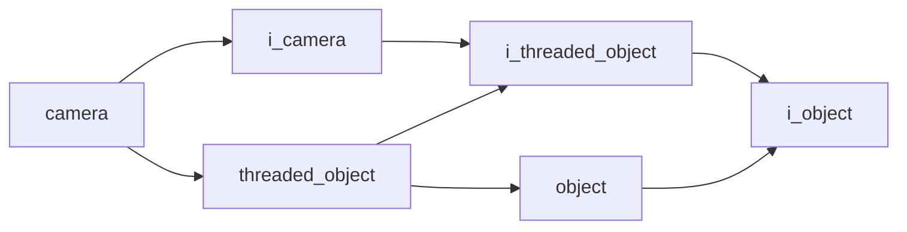

# Camera

- **Class**: `camera`
- **Namespace**: `acs::vision`
- **Include**: `#include "vision/implementations/camera.h"`

## Overview

Concrete implementation of `i_camera`.

## Inheritance Diagram

### Base Diagram



## Inheritance Hierarchy

### Base Hierarchy

- [`camera`](camera.md)
  - [`i_camera`](../interfaces/i_camera.md)
    - [`i_threaded_object`](../../core/interfaces/i_threaded_object.md)
      - [`i_object`](../../core/interfaces/i_object.md)
  - [`threaded_object`](../../core/implementations/threaded_object.md)
    - [`i_threaded_object`](../../core/interfaces/i_threaded_object.md)
      - [`i_object`](../../core/interfaces/i_object.md)
    - [`object`](../../core/implementations/object.md)
      - [`i_object`](../../core/interfaces/i_object.md)

## API

### Constructors
#### Constructor

```cpp
camera(std::string_view tag, float update_rate, const parameters_t& parameters);
```
Creates a camera with the specified name.

##### Parameters
- `tag`: The tag.
- `update_rate`: The update rate.
- `parameters`: The parameters.

### Public Methods

#### Implementations
- [`i_camera`](../interfaces/i_camera.md)
    - [`get_color_frame`](../interfaces/i_camera.md#get-color-frame)
    - [`get_depth_frame`](../interfaces/i_camera.md#get-depth-frame)
    - [`get_model`](../interfaces/i_camera.md#get-model)
    - [`get_fps`](../interfaces/i_camera.md#get-fps)
    - [`get_dropped_frames_count`](../interfaces/i_camera.md#get-dropped-frames-count)
    - [`get_is_opened`](../interfaces/i_camera.md#get-is-opened)
    - [`get_zed_camera_ref`](../interfaces/i_camera.md#get-zed-camera-reference)

### Protected Methods
#### Update

```cpp
void update() override;
```
Performs one update cycle.
