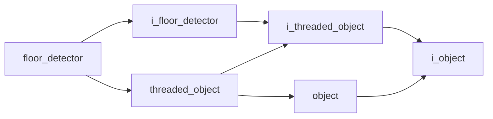

# Floor Detector

- **Class**: `floor_detector`
- **Namespace**: `acs::vision`
- **Include**: `#include "vision/implementations/floor_detector.h"`

## Overview

Concrete `i_floor_detector` implementation that estimates the dominant floor plane from camera data and publishes plane geometry for obstacle reasoning.

## Inheritance Diagram

### Base Diagram



## Inheritance Hierarchy

### Base Hierarchy

- [`floor_detector`](floor_detector.md)
  - [`i_floor_detector`](../interfaces/i_floor_detector.md)
    - [`i_threaded_object`](../../core/interfaces/i_threaded_object.md)
      - [`i_object`](../../core/interfaces/i_object.md)
  - [`threaded_object`](../../core/implementations/threaded_object.md)
    - [`i_threaded_object`](../../core/interfaces/i_threaded_object.md)
      - [`i_object`](../../core/interfaces/i_object.md)
    - [`object`](../../core/implementations/object.md)
      - [`i_object`](../../core/interfaces/i_object.md)

## API

### Constructors
#### Constructor

```cpp
floor_detector(std::string_view tag, float update_rate, std::shared_ptr<i_camera> camera_ptr);
```
Creates a floor detector bound to a camera source and periodic update loop.

##### Parameters
- `tag`: Unique component tag used for logging and lifecycle identification.
- `update_rate`: Requested detection frequency in Hz for floor-plane estimation.
- `camera_ptr`: Shared camera dependency that provides synchronized RGB/depth data used during floor extraction.

### Public Methods

#### Implementations
- [`i_floor_detector`](../interfaces/i_floor_detector.md)
    - [`get_detected_floor_plane`](../interfaces/i_floor_detector.md#get-detected-floor-plane)
    - [`get_plane_equation`](../interfaces/i_floor_detector.md#get-plane-equation)
    - [`get_is_floor_detected`](../interfaces/i_floor_detector.md#get-is-floor-detected)

### Protected Methods
#### Update

```cpp
void update() override;
```
Processes the latest camera data to detect and cache floor-plane geometry and detection state.
