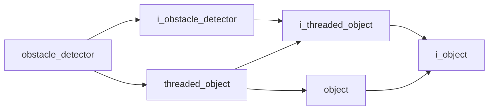

# Obstacle Detector

- **Class**: `obstacle_detector`
- **Namespace**: `acs::vision`
- **Include**: `#include "vision/implementations/obstacle_detector.h"`

## Overview

Concrete `i_obstacle_detector` implementation that analyzes camera data to identify obstacles in the scene and summarize zone occupancy outputs.

## Inheritance Diagram

### Base Diagram



## Inheritance Hierarchy

### Base Hierarchy

- [`obstacle_detector`](obstacle_detector.md)
  - [`i_obstacle_detector`](../interfaces/i_obstacle_detector.md)
    - [`i_threaded_object`](../../core/interfaces/i_threaded_object.md)
      - [`i_object`](../../core/interfaces/i_object.md)
  - [`threaded_object`](../../core/implementations/threaded_object.md)
    - [`i_threaded_object`](../../core/interfaces/i_threaded_object.md)
      - [`i_object`](../../core/interfaces/i_object.md)
    - [`object`](../../core/implementations/object.md)
      - [`i_object`](../../core/interfaces/i_object.md)

## API

### Constructors
#### Constructor

```cpp
obstacle_detector(float update_rate, const parameters_t& parameters, std::shared_ptr<i_camera> camera_ptr);
```
Creates an obstacle detector that runs the obstacle extraction pipeline at a fixed update rate.

##### Parameters
- `update_rate` (`float`): Requested detection frequency in Hz for obstacle analysis.
- `parameters` (`const parameters_t&`): Obstacle-detection configuration bundle (thresholds, filtering, and model-specific runtime settings).
- `camera_ptr` (`std::shared_ptr<i_camera>`): Shared camera dependency that provides the live RGB/depth frames used for obstacle inference.

### Nested Types

#### Structs
##### Parameters T

```cpp
struct parameters_t {
  float obstacle_min_range;
  float obstacle_max_range;
  float obstacle_height_threshold;
  float min_contour_area;
  float road_width;
};
```
Obstacle detection settings used during scene processing.

- `obstacle_min_range` (`float`): Minimum obstacle range in meters.
- `obstacle_max_range` (`float`): Maximum obstacle range in meters.
- `obstacle_height_threshold` (`float`): Minimum height above the floor used to classify obstacles.
- `min_contour_area` (`float`): Minimum contour area kept as an obstacle candidate.
- `road_width` (`float`): Nominal road width in meters used by zoning and obstacle interpretation.

### Public Methods

#### Implementations
- [`i_obstacle_detector`](../interfaces/i_obstacle_detector.md)
    - [`get_obstacle_min_range`](../interfaces/i_obstacle_detector.md#get-obstacle-min-range)
    - [`get_obstacle_max_range`](../interfaces/i_obstacle_detector.md#get-obstacle-max-range)
    - [`get_obstacle_height_threshold`](../interfaces/i_obstacle_detector.md#get-obstacle-height-threshold)
    - [`get_road_width`](../interfaces/i_obstacle_detector.md#get-road-width)
    - [`get_union_box`](../interfaces/i_obstacle_detector.md#get-union-box)
    - [`get_union_crop_buffer`](../interfaces/i_obstacle_detector.md#get-union-crop-buffer)
    - [`get_left_crop_buffer`](../interfaces/i_obstacle_detector.md#get-left-crop-buffer)
    - [`get_center_crop_buffer`](../interfaces/i_obstacle_detector.md#get-center-crop-buffer)
    - [`get_right_crop_buffer`](../interfaces/i_obstacle_detector.md#get-right-crop-buffer)
    - [`get_zone_results`](../interfaces/i_obstacle_detector.md#get-zone-results)

### Protected Methods
#### Update

```cpp
void update() override;
```
Runs one obstacle-detection cycle and updates cached detection outputs for consumers.
