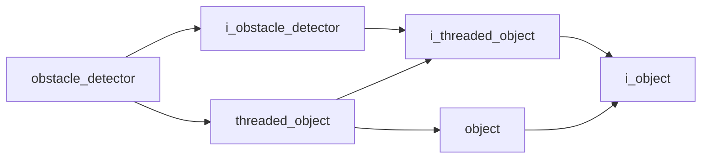

# Obstacle Detector

- **Class**: `obstacle_detector`
- **Namespace**: `acs::vision`
- **Include**: `#include "vision/implementations/obstacle_detector.h"`

## Overview

Concrete `i_obstacle_detector` implementation that fuses camera data and floor-plane estimation to identify obstacles in the scene.

## Inheritance Diagram

### Base Diagram



## Inheritance Hierarchy

### Base Hierarchy

- [`obstacle_detector`](obstacle_detector.md)
  - [`i_obstacle_detector`](../interfaces/i_obstacle_detector.md)
    - [`i_threaded_object`](../../core/interfaces/i_threaded_object.md)
      - [`i_object`](../../core/interfaces/i_object.md)
  - [`threaded_object`](../../core/implementations/threaded_object.md)
    - [`i_threaded_object`](../../core/interfaces/i_threaded_object.md)
      - [`i_object`](../../core/interfaces/i_object.md)
    - [`object`](../../core/implementations/object.md)
      - [`i_object`](../../core/interfaces/i_object.md)

## API

### Constructors
#### Constructor

```cpp
obstacle_detector(std::string_view tag,
                  float update_rate,
                  const parameters_t& parameters,
                  std::shared_ptr<i_camera> camera_ptr,
                  std::shared_ptr<i_floor_detector> floor_detector_ptr);
```
Creates an obstacle detector that runs the obstacle extraction pipeline at a fixed update rate.

##### Parameters
- `tag`: Unique component tag used for logging and lifecycle identification.
- `update_rate`: Requested detection frequency in Hz for obstacle analysis.
- `parameters`: Obstacle-detection configuration bundle (thresholds, filtering, and model-specific runtime settings).
- `camera_ptr`: Shared camera dependency that provides the live RGB/depth frames used for obstacle inference.
- `floor_detector_ptr`: Shared floor-detector dependency used to mask floor regions and improve obstacle separation.

### Public Methods

#### Implementations
- [`i_obstacle_detector`](../interfaces/i_obstacle_detector.md)
    - [`get_color_frame`](../interfaces/i_obstacle_detector.md#get-color-frame)
    - [`get_depth_frame`](../interfaces/i_obstacle_detector.md#get-depth-frame)
    - [`get_model`](../interfaces/i_obstacle_detector.md#get-model)
    - [`get_fps`](../interfaces/i_obstacle_detector.md#get-fps)
    - [`get_dropped_frames_count`](../interfaces/i_obstacle_detector.md#get-dropped-frames-count)
    - [`get_is_opened`](../interfaces/i_obstacle_detector.md#get-is-opened)
    - [`get_native_camera_ref`](../interfaces/i_obstacle_detector.md#get-native-camera-reference)

### Protected Methods
#### Update

```cpp
void update() override;
```
Runs one obstacle-detection cycle and updates cached detection outputs for consumers.
