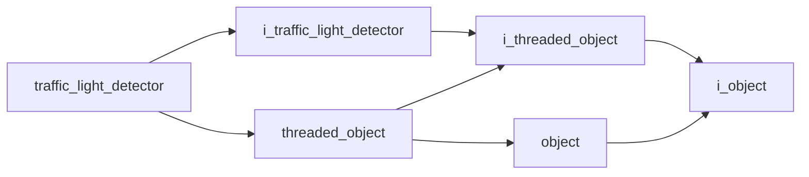

# Traffic Light Detector

- **Class**: `traffic_light_detector`
- **Namespace**: `acs::vision`
- **Include**: `#include "vision/implementations/traffic_light_detector.h"`

## Overview

Concrete `i_traffic_light_detector` implementation that analyzes obstacle-region imagery with red-light scoring heuristics to determine the active signal state.

## Inheritance Diagram

### Base Diagram



## Inheritance Hierarchy

### Base Hierarchy

- [`traffic_light_detector`](traffic_light_detector.md)
  - [`i_traffic_light_detector`](../interfaces/i_traffic_light_detector.md)
    - [`i_threaded_object`](../../core/interfaces/i_threaded_object.md)
      - [`i_object`](../../core/interfaces/i_object.md)
  - [`threaded_object`](../../core/implementations/threaded_object.md)
    - [`i_threaded_object`](../../core/interfaces/i_threaded_object.md)
      - [`i_object`](../../core/interfaces/i_object.md)
    - [`object`](../../core/implementations/object.md)
      - [`i_object`](../../core/interfaces/i_object.md)

## API

### Constructors
#### Constructor

```cpp
traffic_light_detector(float update_rate, const parameters_t& parameters, std::shared_ptr<i_obstacle_detector> obstacle_detector);
```
Creates a traffic-light detector with update cadence, heuristic thresholds, and the shared obstacle-analysis dependency it consumes.

##### Parameters
- `update_rate` (`float`): Requested detection frequency in Hz for traffic-light inference.
- `parameters` (`const parameters_t&`): Traffic-light detector configuration bundle (candidate-filtering thresholds and state-debouncing settings).
- `obstacle_detector` (`std::shared_ptr<i_obstacle_detector>`): Shared obstacle-detector dependency used for scene context and candidate filtering.

### Nested Types

#### Structs
##### Parameters T

```cpp
struct parameters_t {
  int min_pixel_size;
  int min_blown_core_pixels;
  float max_aspect_ratio;
  int on_threshold;
  int off_threshold;
};
```
Traffic-light detection settings used during candidate filtering, red-signal scoring, and state debouncing.

- `min_pixel_size` (`int`): Minimum candidate size in pixels required before a region is considered for traffic-light analysis.
- `min_blown_core_pixels` (`int`): The min blown core pixels.
- `max_aspect_ratio` (`float`): The max aspect ratio.
- `on_threshold` (`int`): Consecutive positive detections required to switch state to red-light active.
- `off_threshold` (`int`): Consecutive negative detections required to clear the red-light active state.

### Public Methods

#### Implementations
- [`i_traffic_light_detector`](../interfaces/i_traffic_light_detector.md)
    - [`is_red_light_detected`](../interfaces/i_traffic_light_detector.md#is-red-light-detected)

### Protected Methods
#### Update

```cpp
void update() override;
```
Runs one traffic-light detection cycle and updates cached red-light state.
