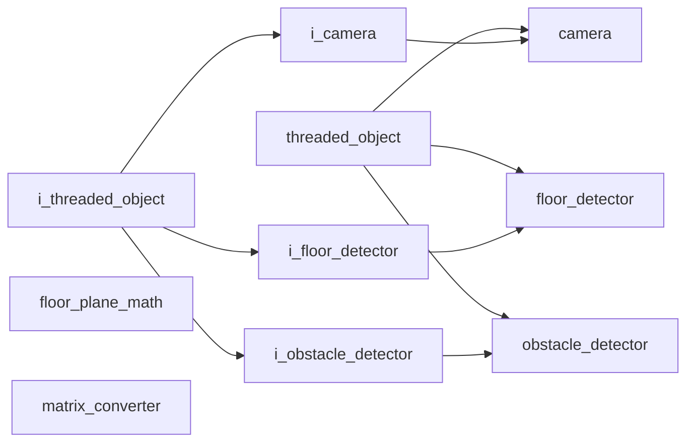

# Vision Namespace

## Overview

The `acs::vision` namespace contains components for camera access, scene understanding, and visualization. It implements the detection pipeline for obstacles using ZED stereo camera hardware.

## Namespace Contents

### Interfaces

- [i_camera](interfaces/i_camera.md)
- [i_floor_detector](interfaces/i_floor_detector.md)
- [i_obstacle_detector](interfaces/i_obstacle_detector.md)

### Implementations

- [camera](implementations/camera.md)
- [floor_detector](implementations/floor_detector.md)
- [floor_plane_math](utility/floor_plane_math.md)
- [matrix_converter](utility/matrix_converter.md)
- [obstacle_detector](implementations/obstacle_detector.md)

## Inheritance Hierarchy

