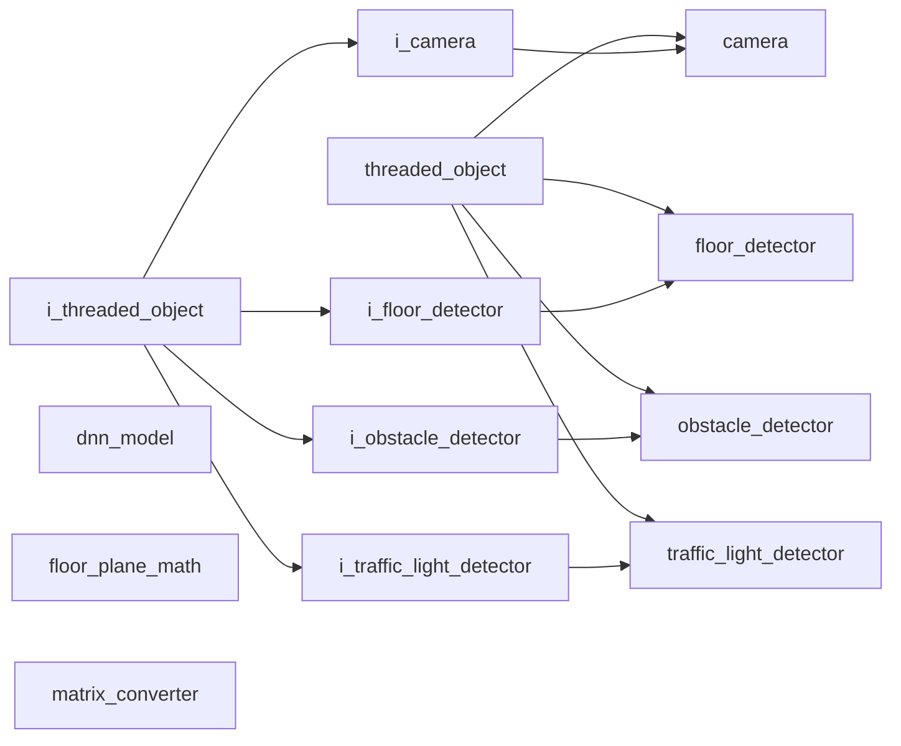

# Vision Namespace

## Overview

The `acs::vision` namespace contains perception objects and interfaces for camera access, floor estimation, obstacle detection, and traffic-light state inference using ZED stereo data.

## Namespace Contents

### Interfaces

- [i_camera](interfaces/i_camera.md)
- [i_floor_detector](interfaces/i_floor_detector.md)
- [i_obstacle_detector](interfaces/i_obstacle_detector.md)
- [i_traffic_light_detector](interfaces/i_traffic_light_detector.md)

### Implementations

- [camera](implementations/camera.md)
- [dnn_model](utility/dnn_model.md)
- [floor_detector](implementations/floor_detector.md)
- [floor_plane_math](utility/floor_plane_math.md)
- [matrix_converter](utility/matrix_converter.md)
- [obstacle_detector](implementations/obstacle_detector.md)
- [traffic_light_detector](implementations/traffic_light_detector.md)

## Inheritance Hierarchy

