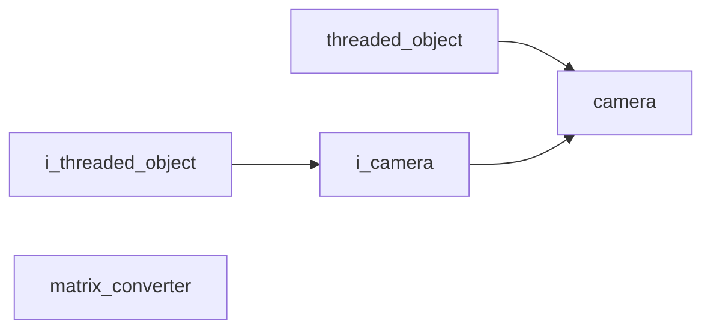

# Vision Namespace

## Overview

The `acs::vision` namespace contains components for camera access, scene understanding, and visualization. It implements the detection pipeline for obstacles using ZED stereo camera hardware.

## Namespace Contents

### Interfaces

- [i_camera](interfaces/i_camera.md)

### Implementations

- [camera](implementations/camera.md)
- [matrix_converter](utility/matrix_converter.md)

## Inheritance Hierarchy

