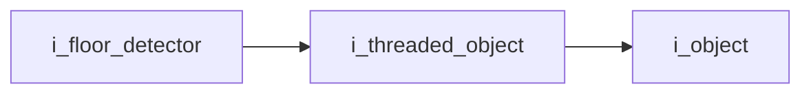
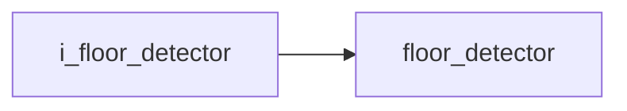

# Floor Detector Interface

- **Interface**: `i_floor_detector`
- **Namespace**: `acs::vision`
- **Include**: `#include "vision/interfaces/i_floor_detector.h"`

## Overview

Interface that defines floor-plane detection outputs produced by the threaded floor-estimation pipeline.

## Inheritance Diagram

### Base Diagram



### Derived Diagram



## Inheritance Hierarchy

### Base Hierarchy

- [`i_floor_detector`](i_floor_detector.md)
  - [`i_threaded_object`](../../core/interfaces/i_threaded_object.md)
    - [`i_object`](../../core/interfaces/i_object.md)

### Derived Hierarchy

- [`i_floor_detector`](i_floor_detector.md)
  - [`floor_detector`](../implementations/floor_detector.md)

## API

### Public Methods
#### Get Detected Floor Plane

```cpp
[[nodiscard]] virtual sl::Plane get_detected_floor_plane() = 0;
```
Returns the latest detected floor plane object reported by the backend.

!!! note
    Pure virtual method, must be implemented by derived classes.
#### Get Floor Plane Equation

```cpp
[[nodiscard]] virtual sl::float4 get_floor_plane_equation() = 0;
```
Returns the latest floor plane equation coefficients `(a, b, c, d)`.

!!! note
    Pure virtual method, must be implemented by derived classes.
#### Get Is Floor Detected

```cpp
[[nodiscard]] virtual bool get_is_floor_detected() = 0;
```
Returns whether floor detection has successfully produced a valid plane estimate.

!!! note
    Pure virtual method, must be implemented by derived classes.
