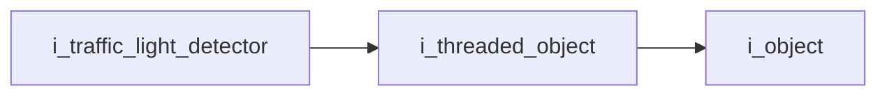
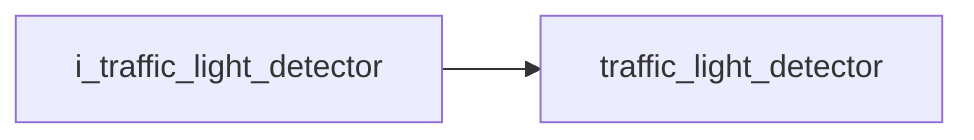

# Traffic Light Detector Interface

- **Interface**: `i_traffic_light_detector`
- **Namespace**: `acs::vision`
- **Include**: `#include "vision/interfaces/i_traffic_light_detector.h"`

## Overview

Interface that defines traffic-light state outputs produced by a threaded perception pipeline.

## Inheritance Diagram

### Base Diagram



### Derived Diagram



## Inheritance Hierarchy

### Base Hierarchy

- [`i_traffic_light_detector`](i_traffic_light_detector.md)
  - [`i_threaded_object`](../../core/interfaces/i_threaded_object.md)
    - [`i_object`](../../core/interfaces/i_object.md)

### Derived Hierarchy

- [`i_traffic_light_detector`](i_traffic_light_detector.md)
  - [`traffic_light_detector`](../implementations/traffic_light_detector.md)

## API

### Public Methods
#### Is Red Light Detected

```cpp
[[nodiscard]] virtual bool is_red_light_detected() = 0;
```
Returns whether a red traffic light is currently considered detected by the pipeline.

!!! note
    Pure virtual method, must be implemented by derived classes.
